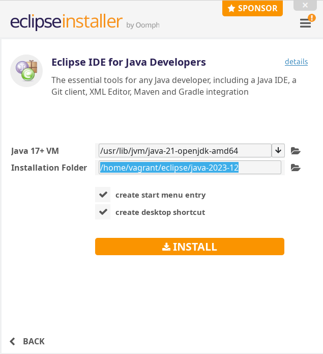
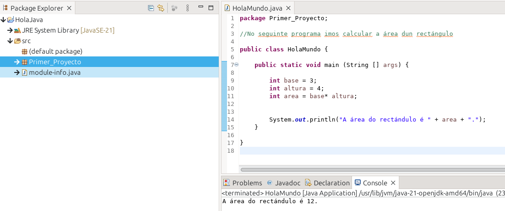

## 1. Inicio:
Primeiro que nada, efectuaremos os seguintes comandos para actualizar o noso equipo:
```Shell
$ sudo apt-get update
$ sudo apt-get upgrade
```

## 2. Razóns:

O IDE seleccionado para realizar este proyecto foi Eclipse, que é un IDE moi utilizado para a creación de proxectos en Java.

## 3. Proceso de instalación 
1. Primeiramente, descargaremos o programa dende a páxina oficial dende o seguinte enlace:

    https://www.eclipse.org/downloads/download.php?file=/oomph/epp/2023-12/R/eclipse-inst-jre-linux64.tar.gz

2. Situámonos na ruta de enlace do terminal onde se descargou o arquivo .zip:

```Shell
$ /home/vagrant/Descargas
```
3. Usamos o seguinte comando:
```Shell
$ tar -xf eclipse-inst-jre-linux64.tar.gz  
```
4. Despois de descargar e descomprimir o arquivo, situámonos na ruta precisa:

```Shell
$ cd eclipse-installer

(/home/vagrant/Descargas/eclipse-installer)

```
5. Realizamos a instalación do mesmo. Para eso, executamos o seguinte comando:

```Shell
$ ./eclipse-inst
```

### 4. Fotos

1. 
    


2. 
    